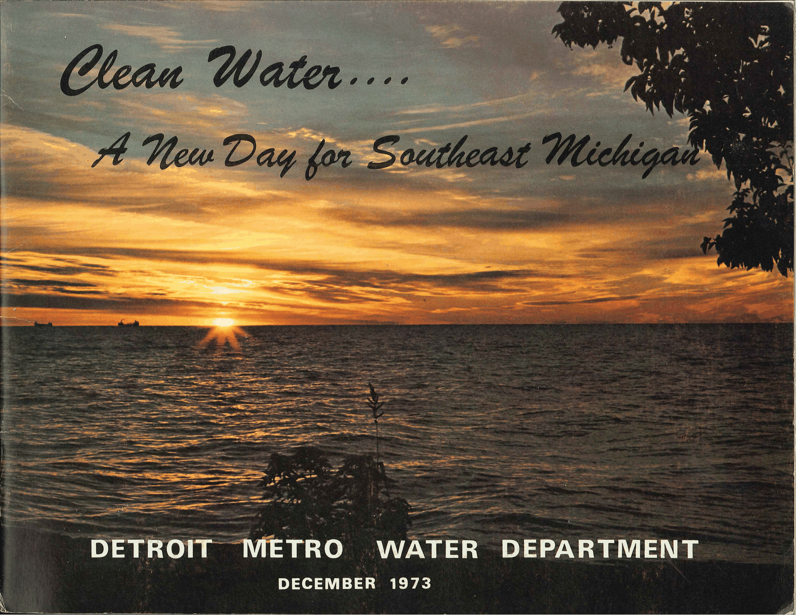
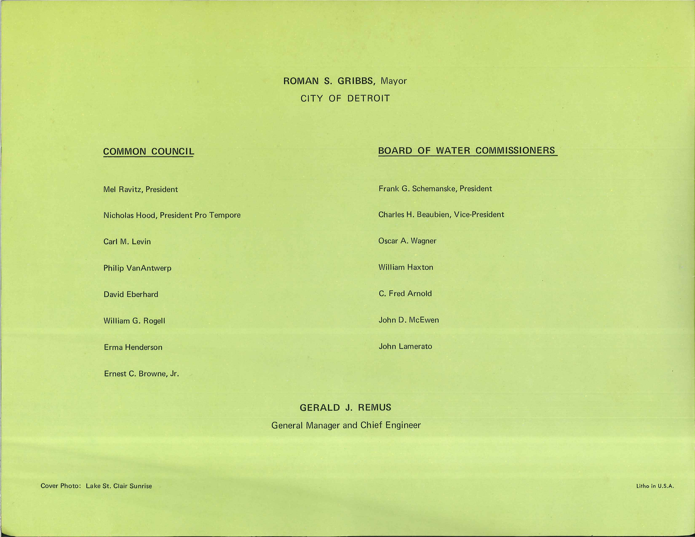

### COMMON COUNCIL

Mel Ravitz, President

Nicholas Hood, President Pro Tempore

Carl M. Levin

Philip VanAntwerp

David Eberhard

William G. Rogel!

Erma Henderson

Ernest C. Browne, Jr.

Cover Photo: Lake St. Clair Sunrise

**ROMAN S. GRIBBS,** Mayor

### CITY OF DETROIT

### BOARD OF WATER COMMISSIONERS

Frank G. Schemanske, President

Charles H. Beaubien, Vice-President

Oscar A. Wagner

William Haxton

C. Fred Arnold

John D. McEwen

John Lamerato

### GERALD J. REMUS

### General Manager and Chief Engineer

Litho in U.S.A.